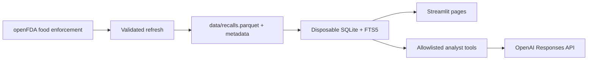
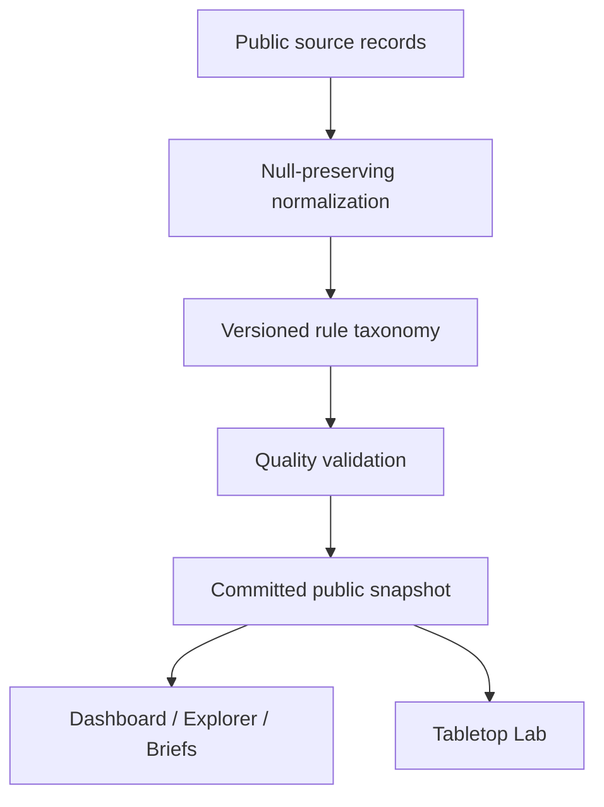

# RecallReady

> Historical U.S. food-enforcement intelligence for transparent analysis and tabletop preparedness—not a consumer alert feed.

[Live demo — add deployed URL](https://example.streamlit.app) · [Methodology](docs/METHODOLOGY.md) · [Architecture](docs/ARCHITECTURE.md)

RecallReady lets quality, operations, supply-chain, regulatory, consulting, and research users explore historical openFDA food enforcement records, inspect source evidence, generate deterministic executive context, and run fictional traceability tabletop exercises. It never determines current product safety, recall lifecycle, legal obligations, or firm risk.

## Screenshots

> Add approved dashboard, explorer, analyst, and tabletop screenshots after deployment. Keep any visible source data historical and redact non-public material.

## Architecture





## Methodology summary

- The source is FDA/openFDA historical food enforcement data, with source freshness retained in snapshot metadata.
- Product records and known events are distinct measures. Event counts exclude records without `event_id`.
- FDA classification is source data; hazard and product labels are transparent, rule-derived, non-official tags.
- Counts are not incidence rates because market-volume denominators are unavailable. Source fields, including pre-2012 gaps, remain missing.

## Local setup

Use Python 3.12:

```bash
make setup
make test
make lint
make typecheck
make smoke
make run
```

`make smoke` requires the committed public `data/recalls.parquet` and `data/snapshot_metadata.json`. Optional local configuration belongs in uncommitted `.env` or `.streamlit/secrets.toml`.

## Deploy on Streamlit Community Cloud

1. Push the public repository with a validated `data/recalls.parquet` and `data/snapshot_metadata.json`.
2. In [Streamlit Community Cloud](https://share.streamlit.io/), create an app from the repository, branch, and `app.py` entrypoint.
3. Select Python 3.12 in Advanced settings.
4. Paste only required secrets from `.streamlit/secrets.toml.example`: `OPENAI_API_KEY`, `OPENAI_MODEL`, and optionally `OPENFDA_API_KEY` for refresh jobs.
5. Deploy. Without OpenAI secrets, the analyst is disabled gracefully and deterministic pages remain available.

## Sample questions

- What were the most common hazard categories among Class I records since 2021?
- Explain the difference between a recall event and a product record.
- Compare undeclared-allergen records in bakery and dairy products.
- Create evidence for a seafood tabletop exercise.

## Testing and operations

CI runs linting, typing, and tests. The scheduled refresh validates before committing only public snapshot artifacts. `scripts/smoke_test.py` checks snapshot artifacts, a runtime SQLite build, summary and FTS queries, and page specifications. Logs redact secrets and avoid full chat prompts.

## Limitations and responsible use

RecallReady is historical analysis only. It is not an alert service or lifecycle tracker, does not establish current safety or compliance, does not provide legal/medical/regulatory advice, does not predict recalls, and does not rank firms. For current consumer recall information, use the [FDA public-warning page](https://www.fda.gov/safety/recalls-market-withdrawals-safety-alerts).

## Attribution and license

Source data are attributed to FDA/openFDA. Review FDA/openFDA terms and the project methodology before reuse. Add the repository license before public release.
