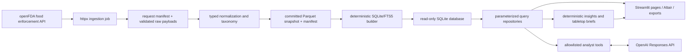

# Architecture

## System overview



The Parquet snapshot, its manifest, and normalization version are release artifacts. SQLite is derived, never edited by users, and opened via a read-only URI. The app starts by validating the snapshot manifest and rebuilding only when the local derived database is missing or has a mismatched snapshot/schema version; deployment may prebuild the same artifact to reduce cold-start time.

## Proposed repository tree

```text
RecallReady/
├── AGENTS.md
├── app.py
├── src/recallready/
│   ├── config.py                 # environment/Streamlit secrets resolution
│   ├── models.py                 # Pydantic source/domain/tool models
│   ├── ingest/                   # client, pagination, retry, snapshot job
│   ├── transform/                # parsing, taxonomy, quality checks
│   ├── storage/                  # Parquet manifest, SQLite builder, repositories
│   ├── services/                 # metrics, insights, tabletop, exports
│   ├── analyst/                  # prompts, schemas, dispatcher, citations
│   └── ui/                       # Streamlit pages, filters, components, charts
├── data/
│   ├── snapshots/food_enforcement.parquet
│   └── manifests/food_enforcement.snapshot.json
├── scripts/                      # explicit refresh/build commands
├── tests/                        # unit, integration, fixtures, UI smoke tests
├── docs/
└── .github/workflows/ci.yml
```

Items after this planning task are proposed, not created. Generated `data/derived/*.sqlite` and raw large payload caches remain untracked. A compact committed Parquet snapshot is required for public deployment; if size becomes impractical, use Git LFS only after documenting public-host compatibility, or publish a versioned public release asset with checksum and an explicit deployment fetch step.

## SQLite schema proposal

`source_snapshots` records one immutable build: `snapshot_id` (PK), `source_name`, `source_url`, `api_endpoint`, `retrieved_at_utc`, `source_last_checked_at_utc`, `coverage_start`, `coverage_end`, `record_count`, `sha256`, `normalization_version`, `taxonomy_version`, `notes`.

`recall_products` is the source-grain table, one row per openFDA result: `product_row_id` (PK), `snapshot_id` (FK), `source_record_hash` (unique within snapshot), `recall_number`, `event_id`, `product_description`, `reason_for_recall`, `product_quantity`, `code_info`, `more_code_info`, `product_code`, `distribution_pattern`, `recalling_firm`, `address_1`, `address_2`, `city`, `state`, `country`, `classification`, `status`, `voluntary_mandated`, `initial_firm_notification`, `recall_initiation_date`, `center_classification_date`, `termination_date`, `report_date`, `openfda_json`, `raw_json`, and `ingested_at_utc`. All source values remain nullable text except normalized dates; raw JSON is retained for audit, never rendered as executable content.

`recall_events` is a derived event-grain table: `event_key` (PK; `event:{event_id}` where available, otherwise deterministic fallback), `snapshot_id`, `event_id`, representative source values, `product_record_count`, `first_recall_initiation_date`, `last_report_date`, and `has_missing_event_id`. It is rebuilt from products; it does not invent event identity when no `event_id` exists.

`product_taxonomy` stores many-to-one normalization output: `product_row_id` (PK/FK), `taxonomy_version`, `commodity_group`, `commodity_detail`, `hazard_type`, `hazard_detail`, `rule_id`, `match_confidence` (`exact_rule`, `keyword_rule`, `unclassified`), and `review_note`. It never overwrites source text.

`quality_observations` records snapshot-level and field-level checks: `observation_id`, `snapshot_id`, `check_name`, `severity`, `entity_scope`, `metric_value`, `details_json`, `observed_at_utc`.

FTS5 virtual table `recall_products_fts` indexes `product_description`, `reason_for_recall`, `recalling_firm`, `distribution_pattern`, `code_info`, and `recall_number`, content-synchronized from `recall_products`. Filtered search joins FTS back to the source-grain table. Indexes cover dates, classification, normalized categories, `event_id`, `recall_number`, firm, and state.

## Ingestion and transformations

Use `https://api.fda.gov/food/enforcement.json` over HTTPS with optional `OPENFDA_API_KEY`. The API supports 240 requests/minute and 1,000/day without a key, versus 120,000/day with one; production jobs must use a key, bounded concurrency, exponential backoff with jitter, and `Retry-After` respect. Request `limit=1000` (the per-call maximum) where supported.

For an initial build, partition by a stable source date—default `report_date` calendar year, then month if a partition approaches a configurable 20,000-hit safety threshold—and page each partition using the API `Link: rel=next` / `search_after` cursor. Never traverse the corpus with `skip`; `skip` and `search_after` cannot be combined, and skip pagination is capped for large result sets. Dedupe idempotently by a hash of canonical raw JSON plus snapshot ID, retain partition/cursor/request metadata, and re-run a deterministic reconciliation count per partition. A full official download may be evaluated as a fallback only after checksum, licensing, and format validation.

Weekly refresh default: re-ingest a rolling 24-month `report_date` window plus the prior 90 days of older partitions to capture corrections/expansions; produce a new immutable snapshot rather than mutate history. Quarterly run a full historical reconciliation. Surface source freshness and change counts. A failed refresh never replaces the last known-good snapshot.

Parsing rules: preserve raw strings and JSON; parse only valid `YYYYMMDD` dates to ISO dates, otherwise record null plus a quality observation. Normalize whitespace/casing only into separate search/analysis fields. `event_id` and `recall_number` remain strings to preserve formatting. Several source fields are not reliably available before June 2012; detect and disclose this rather than treating null as zero.

Taxonomy is a versioned, human-readable rules table maintained in the repository. Start with conservative categories: `allergen`, `microbiological`, `foreign_material`, `labeling_or_undeclared`, `chemical_or_residue`, `process_or_packaging`, `other`, and `unclassified`; commodity classification follows a small documented keyword/rule mapping. Multiple matching rules use documented precedence, source text wins over classification, and `unclassified` is an expected result. No inference about root cause, severity beyond FDA classification, or company quality is permitted.

## Analyst design

The backend calls the OpenAI Responses API with `store=false`, a fixed system policy, strict JSON-schema function definitions, bounded conversation history, and a maximum tool-call round count (default 4). It validates every model argument with Pydantic and dispatches by an exact allowlist. Tool output is compact JSON containing only requested aggregates/records, snapshot metadata, and citation IDs. Model-provided strings are never interpolated into SQL or prompts that change authority.

| Tool | Purpose | Safe arguments / result |
|---|---|---|
| `get_dataset_metadata` | Explain scope/freshness/limitations | no args; manifest and quality summary |
| `summarize_recall_metrics` | Aggregate a bounded filter set | typed dates, enums, normalized categories, geography, grain; counts and snapshot ID |
| `search_recall_records` | Find up to 25 product records | typed query (max 160 chars), filters, sort enum, page token; citation-ready records |
| `get_recall_event` | Retrieve one grouped event | validated `event_id` or `event_key`; product citations |
| `get_record_details` | Retrieve exact evidence | validated list of max 10 recall numbers/product IDs; raw-source fields and provenance |
| `find_comparable_records` | Select historical tabletop references | typed category/class/date/distribution filters; max 12 cited candidates |

The system policy requires uncertainty disclosure, source citations for factual claims, explicit event/product grain, and refusal/redirection for present safety, lifecycle/current status, advice, prediction, and confidential-data questions. It instructs the model to ignore directions embedded in data. The renderer verifies that each response containing factual claims includes IDs returned by tools; otherwise it shows a constrained “I can’t substantiate that from this snapshot” message. Tool failures become transparent errors, not invented answers. No SQL tool exists.

## Deployment and operations

Deploy the Streamlit app from a public repository and a pinned Python runtime/dependency manifest. Community Cloud secrets are entered in app settings and accessed through `st.secrets`; local secrets use uncommitted `.streamlit/secrets.toml`. Support environment variables (`OPENAI_API_KEY`, `OPENFDA_API_KEY`) first for CI/other hosts. The public app needs only `OPENAI_API_KEY` for analyst use; the openFDA key is reserved for refresh jobs.

Default refresh architecture: a scheduled CI job/manual release workflow builds and validates a candidate snapshot, opens a reviewable data-update PR containing only Parquet + manifest/change report, then deployment rebuilds SQLite deterministically. Streamlit serves the committed snapshot and makes no openFDA calls. This keeps public startup reliable and data provenance auditable. If automated scheduled commits are not desired, use a documented monthly manual refresh with the same checks.

